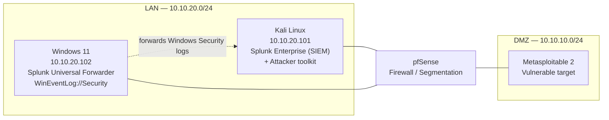
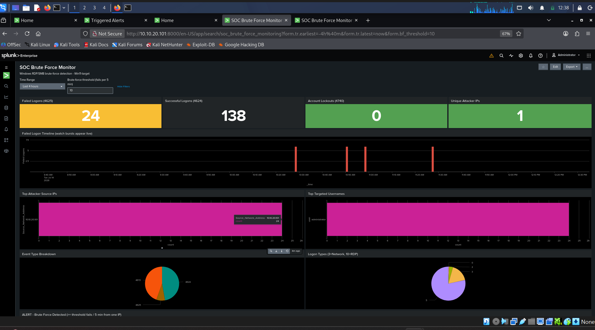

# Purple Team Detection Lab

> A self-built, network-segmented lab where offensive techniques are executed, detected in a SIEM, and tuned — every attack paired with its detection and mapped to MITRE ATT&CK.


## What this project demonstrates

I built an isolated, firewall-segmented lab to practice **detection engineering** end-to-end: run a real attack, capture the telemetry it generates, write a detection for it, validate the alert fires, then tune out the noise. The detections are version-controlled as code (Sigma), mapped to MITRE ATT&CK techniques, and validated in CI.

The goal is to show the full purple-team loop — not just "I have a SIEM," but **attack executed → raw event → detection logic → alert firing → tuning decision** — for each technique.

## Lab architecture



| Component | Role | Address |
|---|---|---|
| pfSense | Firewall, network segmentation (LAN / DMZ) | gateway |
| Kali Linux | SIEM host (Splunk Enterprise) + attacker box | 10.10.20.101 |
| Windows 11 | Detection target; Splunk Universal Forwarder shipping `WinEventLog://Security` | 10.10.20.102 |
| Metasploitable 2 | Deliberately vulnerable target in the DMZ | 10.10.10.0/24 |

**Stack:** Splunk Enterprise · Splunk Universal Forwarder · Sigma · MITRE ATT&CK · pfSense · NetExec · GitHub Actions (CI)

> Splunk UI: `http://10.10.20.101:8000`

## Detection catalog

| # | Technique | ATT&CK ID | Data source | Detection | Status |
|---|---|---|---|---|---|
| 1 | SMB Brute Force | T1110.001 | Windows Security (4625) | `smb_bruteforce.yml` | ✅ Firing |
| 2 | RDP Brute Force | T1110.001 · T1021.001 | Windows Security (4625, Logon Type 10) | `rdp_bruteforce.yml` | ✅ Firing |
| 3 | Network Service Discovery | T1046 | pfSense / firewall logs | `nmap_scan.yml` | 🚧 In progress |
| 4 | ARP Cache Poisoning (AiTM) | T1557.002 | Network / pfSense | `arp_spoof.yml` | 🚧 Planned |

## Worked example: SMB brute force (attack → detect → tune)

### 1. Attack

Password guessing against SMB on the Windows 11 host using **NetExec (`nxc`)** — Windows 11 negotiates SMBv2/3, which Hydra's SMB module doesn't handle cleanly, so NetExec is the correct tool.

```bash
nxc smb 10.10.20.102 -u administrator -p wordlist.txt
```

Each failed attempt generates **Event ID 4625** on the target. *(Test credentials are intentionally not published.)*

### 2. Detect

The core detection counts failed logons per source over a short window:

```spl
index=* host="Win11-target" source="WinEventLog:Security" EventCode=4625
| stats count AS failed_attempts,
        values(Account_Name) AS targeted_accounts,
        min(_time) AS first_attempt,
        max(_time) AS last_attempt
        by Source_Network_Address
| where failed_attempts > 5
| sort - failed_attempts
```

**Validated result:** source `10.10.20.101`, 6 failed attempts against `administrator`, entire burst under one second — an automation signature no human produces. Saved as a scheduled alert (severity High) that fires into the Triggered Alerts queue.


   
   

### 3. Tune

Field names differ by ingestion path — Splunk's compiler-generated vs. raw ingestion name the same data differently (`Source_Network_Address` / `Account_Name`), so the rule ships in two SPL variants to fire regardless of onboarding. The sub-second burst window also enables rate-based logic to separate automated brute force from a user mistyping a password.

## Engineering findings

- **Field-name normalization matters.** Identical events surface under different field names depending on ingestion path; detections must account for both or they silently fail.
- **Segmentation only works if hosts are actually segmented.** Attacker (Kali) and target (Win11) share a subnet, so pfSense block rules never see the intra-subnet traffic. *Fix in progress:* relocate the target to the DMZ so attack traffic traverses the firewall.
- **Tool choice is dictated by the target.** Hydra's SMB module fails against Windows 11's SMBv2/3; NetExec is the right tool.

## Repository structure

```
├── rules/                  # Sigma detection rules
├── spl/                    # Splunk SPL translations
├── screenshots/            # Alert + dashboard evidence
└── .github/workflows/      # CI: validates Sigma rule syntax
```

Project 2: Network Service Discovery Detection (T1046)

Data source: pfSense firewall logs (syslog → Splunk)
ATT&CK: T1046 — Network Service Discovery
Rule: rules/nmap_port_scan.yml
Severity: Medium (reconnaissance, not compromise)

Project 1 detected an attack using Windows Security events. This project deliberately uses a
different telemetry source — network firewall logs — to cover an attack that leaves no trace
on the endpoint at all.

Attack

Nmap TCP SYN scan from Kali (LAN) against Metasploitable 2 (DMZ), crossing pfSense:

bashsudo nmap -sS -p 1-1000 10.10.10.101

1000 ports probed in 3.3 seconds; 12 open services identified (ftp, telnet, smtp, netbios-ssn,
microsoft-ds, and the r-services on 512/513/514).

Why the scan had to cross segments. Project 1 documented that Kali and the Windows target
share the 10.10.20.0/24 LAN, so pfSense never sees traffic between them. Scanning the DMZ host
forces the traffic through the firewall, making it visible. The lab's own topology limitation
dictated the target choice.

Show Image

Telemetry pipeline

pfSense has no Splunk forwarder — it ships logs via syslog. Setup:


Splunk UDP:514 input, sourcetype pfsense
pfSense → Status → System Logs → Settings → Remote Logging → 10.10.20.101:514, Firewall Events only
Enabled logging on the LAN allow rule


Step 3 is the one that matters. pfSense logs its default deny rule automatically but ships
allow rules with logging off. The Nmap scan is permitted traffic, so with default settings
the firewall passes all 1000 packets and writes nothing. A firewall having visibility of traffic
and a firewall recording it are two different things.

Show Image

Parsing

Splunk indexes pfSense filterlog events as unstructured text — no src_ip, no dest_port,
no action. Fields are extracted at search time with rex against pfSense's documented CSV
field order:

splindex=main sourcetype=pfsense filterlog
| rex "filterlog\[\d+\]:\s(?<rule>[^,]*),(?<sub_rule>[^,]*),(?<anchor>[^,]*),(?<tracker>[^,]*),(?<iface>[^,]*),(?<reason>[^,]*),(?<action>[^,]*),(?<direction>[^,]*),(?<ip_ver>[^,]*),(?<tos>[^,]*),(?<ecn>[^,]*),(?<ttl>[^,]*),(?<id>[^,]*),(?<offset>[^,]*),(?<flags>[^,]*),(?<proto_id>[^,]*),(?<proto>[^,]*),(?<length>[^,]*),(?<src_ip>[^,]*),(?<dest_ip>[^,]*),(?<src_port>[^,]*),(?<dest_port>[^,]*)"
| table _time, action, proto, src_ip, src_port, dest_ip, dest_port

This keeps the detection self-contained — it runs against raw ingestion without requiring the
pfSense TA to be installed first.

Show Image

Detection

splindex=main sourcetype=pfsense filterlog
| rex "<see above>"
| search proto=tcp
| stats dc(dest_port) as unique_ports, count as total_packets,
        min(_time) as first_seen, max(_time) as last_seen by src_ip, dest_ip
| eval duration_sec=round(last_seen-first_seen,2)
| eval ports_per_sec=round(unique_ports/(duration_sec+1),1)
| where unique_ports > 50
| convert ctime(first_seen), ctime(last_seen)
| sort - unique_ports

No individual packet is malicious. The detection is behavioural: it asks how many distinct
destination ports a single source touched on a single host. Normal clients touch a handful.

Result: 186 unique ports, 218 packets, 10.10.20.101 → 10.10.10.101.

Show Image

A secondary indicator visible in the parsed data: src_port stayed fixed at 42996 across every
probe while dest_port varied randomly. A normal TCP client draws a fresh ephemeral source port
per connection; Nmap's SYN scan reuses one raw socket. This is a viable detection on its own.

Finding: firewall log fidelity collapses under scan bursts

Nmap sent 1000 probes. Splunk indexed ~186. Roughly 80% of the scan was never logged.

The loss was isolated with a packet capture on the Splunk host, run while the scan executed:

bashsudo tcpdump -i eth0 -n udp port 514 | wc -l
# 114 packets captured, 0 packets dropped by kernel

Only ~114 syslog datagrams crossed the wire against 1000 probes — and some of those were
unrelated background traffic. This rules out the two obvious suspects: UDP transport loss and
Splunk's receive buffer are both exonerated, because the packets never left pfSense to begin
with. The loss occurs inside pfSense, before the log becomes a log.

Mechanism is consistent with pflog0 buffer overflow — pfSense writes matched packets to a
fixed-size BPF device that the filterlog daemon drains, and at ~300 packets/second the buffer
fills faster than it can be read, with the excess discarded silently. This is an inference from
the isolation test, not a directly measured cause; netstat -B on the pfSense shell would
confirm it via per-device drop counters.

The firewall enforced all 1000 packets correctly. It only narrated about 11% of them.

Consequence for detection design. No downstream fix recovers this data — TCP syslog, TLS,
or a disk-buffering collector would all inherit the same loss, because it happens at the source.
The pipeline's fidelity degrades precisely when an attack is loudest. This directly shaped the
rule:

ApproachBehaviour under 89% log lossdc(dest_port) > 50 — cardinalityFires. 186 distinct ports still clears the thresholdcount > 900 — volumeSilent. Sees 218 packets, misses the scan entirely

Cardinality-based thresholds degrade gracefully under sampling; volume-based thresholds do not.
A threshold tuned against the attack's true rate rather than the pipeline's observed rate is
a rule that fails when it matters.

Alerting

Saved as a scheduled alert, hourly, 60-minute lookback, trigger on Number of Results > 0
(the where unique_ports > 50 clause is doing the real filtering), throttled to suppress
duplicates.

Medium severity, deliberately. A port scan is an adversary looking, not an adversary in.
Project 1's brute-force is High because it is an access attempt. Grading all detections High
trains analysts to ignore the queue.

Detection-as-code

rules/nmap_port_scan.yml is a two-document Sigma rule: a base event rule for permitted TCP
traffic, and a value_count correlation over it grouped by source/destination.

$ sigma check rules/nmap_port_scan.yml
Found 0 errors, 0 condition errors and 0 issues.

$ sigma convert -t splunk --without-pipeline rules/nmap_port_scan.yml
action="pass" proto="tcp"
| bin _time span=5m
| stats dc(dest_port) as value_count by _time src_ip dest_ip
| search value_count >= 50

The rule validates clean and compiles. Two honest caveats on the compiled output:

1. No pfSense pipeline exists. sigma list pipelines splunk returns only splunk_windows,
splunk_sysmon_acceleration, and splunk_cim — all Windows or CIM. Conversion therefore
requires --without-pipeline, which passes field names through verbatim. The compiled query
works against this lab only because the rex extractions were named to match Sigma's field
names. Sigma expresses detection logic; it does not express field extraction. Run the
compiled query against raw pfSense ingestion and it returns zero events, because action and
dest_port do not exist until rex creates them. Anyone reusing this rule must supply their
own parsing.

2. Tumbling vs. sliding windows. bin _time span=5m buckets on fixed clock boundaries.
A scan straddling a boundary is split across two buckets, and each half may fall below the
threshold. Sigma's timespan cannot express a sliding window. The hand-written SPL above has
no bin and is not subject to this.

Both queries ship: the compiled one demonstrates portability, the hand-written one is the
implementation that runs.

## About

Built by **Mithil Pashapu** — M.S. Cybersecurity (Florida Atlantic University). Detection engineering / SOC / purple team.

- GitHub: [Mithilreddy62](https://github.com/Mithilreddy62)
