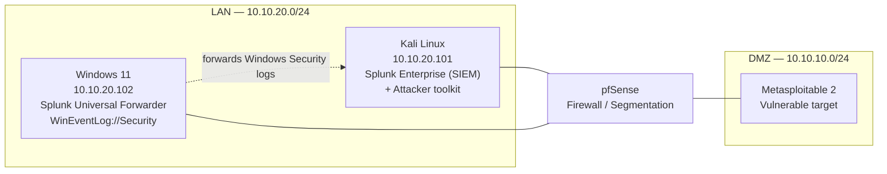
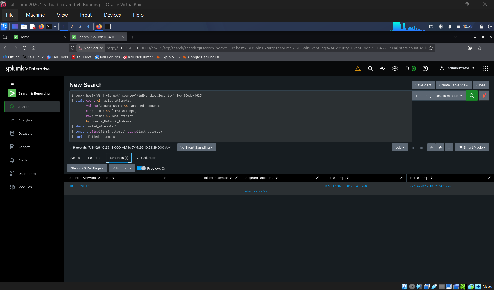
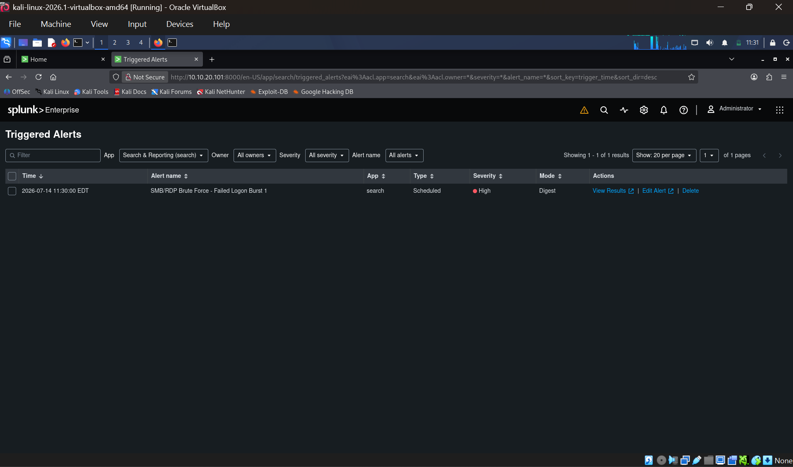

# Purple Team Detection Lab

> A self-built, network-segmented lab where offensive techniques are executed, detected in a SIEM, and tuned — every attack paired with its detection and mapped to MITRE ATT&CK.


## What this project demonstrates

I built an isolated, firewall-segmented lab to practice **detection engineering** end-to-end: run a real attack, capture the telemetry it generates, write a detection for it, validate the alert fires, then tune out the noise. The detections are version-controlled as code (Sigma), mapped to MITRE ATT&CK techniques, and validated in CI.

The goal is to show the full purple-team loop — not just "I have a SIEM," but **attack executed → raw event → detection logic → alert firing → tuning decision** — for each technique.

## Lab architecture



| Component | Role | Address |
|---|---|---|
| pfSense | Firewall, network segmentation (LAN / DMZ) | gateway |
| Kali Linux | SIEM host (Splunk Enterprise) + attacker box | 10.10.20.101 |
| Windows 11 | Detection target; Splunk Universal Forwarder shipping `WinEventLog://Security` | 10.10.20.102 |
| Metasploitable 2 | Deliberately vulnerable target in the DMZ | 10.10.10.0/24 |

**Stack:** Splunk Enterprise · Splunk Universal Forwarder · Sigma · MITRE ATT&CK · pfSense · NetExec · GitHub Actions (CI)

> Splunk UI: `http://10.10.20.101:8000`

## Detection catalog

| # | Technique | ATT&CK ID | Data source | Detection | Status |
|---|---|---|---|---|---|
| 1 | SMB Brute Force | T1110.001 | Windows Security (4625) | `smb_bruteforce.yml` | ✅ Firing |
| 2 | RDP Brute Force | T1110.001 · T1021.001 | Windows Security (4625, Logon Type 10) | `rdp_bruteforce.yml` | ✅ Firing |
| 3 | Network Service Discovery | T1046 | pfSense / firewall logs | `nmap_scan.yml` | 🚧 In progress |
| 4 | ARP Cache Poisoning (AiTM) | T1557.002 | Network / pfSense | `arp_spoof.yml` | 🚧 Planned |

## Worked example: SMB brute force (attack → detect → tune)

### 1. Attack

Password guessing against SMB on the Windows 11 host using **NetExec (`nxc`)** — Windows 11 negotiates SMBv2/3, which Hydra's SMB module doesn't handle cleanly, so NetExec is the correct tool.

```bash
nxc smb 10.10.20.102 -u administrator -p wordlist.txt
```

Each failed attempt generates **Event ID 4625** on the target. *(Test credentials are intentionally not published.)*

### 2. Detect

The core detection counts failed logons per source over a short window:

```spl
index=* host="Win11-target" source="WinEventLog:Security" EventCode=4625
| stats count AS failed_attempts,
        values(Account_Name) AS targeted_accounts,
        min(_time) AS first_attempt,
        max(_time) AS last_attempt
        by Source_Network_Address
| where failed_attempts > 5
| sort - failed_attempts
```

**Validated result:** source `10.10.20.101`, 6 failed attempts against `administrator`, entire burst under one second — an automation signature no human produces. Saved as a scheduled alert (severity High) that fires into the Triggered Alerts queue.


   

### 3. Tune

Field names differ by ingestion path — Splunk's compiler-generated vs. raw ingestion name the same data differently (`Source_Network_Address` / `Account_Name`), so the rule ships in two SPL variants to fire regardless of onboarding. The sub-second burst window also enables rate-based logic to separate automated brute force from a user mistyping a password.

## Engineering findings

- **Field-name normalization matters.** Identical events surface under different field names depending on ingestion path; detections must account for both or they silently fail.
- **Segmentation only works if hosts are actually segmented.** Attacker (Kali) and target (Win11) share a subnet, so pfSense block rules never see the intra-subnet traffic. *Fix in progress:* relocate the target to the DMZ so attack traffic traverses the firewall.
- **Tool choice is dictated by the target.** Hydra's SMB module fails against Windows 11's SMBv2/3; NetExec is the right tool.

## Repository structure

```
├── rules/                  # Sigma detection rules
├── spl/                    # Splunk SPL translations
├── screenshots/            # Alert + dashboard evidence
└── .github/workflows/      # CI: validates Sigma rule syntax
```

## About

Built by **Mithil Pashapu** — M.S. Cybersecurity (Florida Atlantic University). Detection engineering / SOC / purple team.

- GitHub: [Mithilreddy62](https://github.com/Mithilreddy62)
