# Purple Team Detection Lab

> A self-built, network-segmented lab where offensive techniques are executed, detected in a SIEM, and tuned — every attack paired with its detection, version-controlled as code, and mapped to MITRE ATT&CK.


---

## Detections at a glance

Four detection engineering case studies, each following the full purple-team loop — **run a real attack → capture the telemetry → write the detection → validate it fires → tune out the noise** — across two deliberately different telemetry sources:

- **Endpoint** (Windows Security event logs) — brute-force detection where the attack lands *on the host*.
- **Network** (pfSense firewall logs) — reconnaissance detection where the attack leaves *no host-side trace at all*.

Every detection is stored as a Sigma rule, mapped to an ATT&CK technique, and validated in CI. Where the Sigma spec can't express the required logic, the hand-written SPL that actually runs ships alongside it — documented honestly rather than hidden.

| Coverage | Techniques |
| --- | --- |
| **Credential Access** | T1110.001 Brute Force: Password Guessing |
| **Lateral Movement** | T1021.001 Remote Services: RDP |
| **Discovery** | T1046 Network Service Discovery |
| **Collection / AiTM** | T1557.002 ARP Cache Poisoning *(in progress)* |

---

## What this project demonstrates

I built an isolated, firewall-segmented lab to practice **detection engineering** end to end — not "I have a SIEM," but the complete chain: **attack executed → raw event → detection logic → alert firing → tuning decision**, for each technique.

The detections are version-controlled as code (Sigma), mapped to MITRE ATT&CK, and validated in CI on every push. The two projects are deliberately built on *different telemetry sources* to show that detection engineering is about picking the right data source for the attack — an endpoint-only detection strategy would miss the port scan entirely, and an network-only strategy would miss the brute force.

---

## Lab architecture

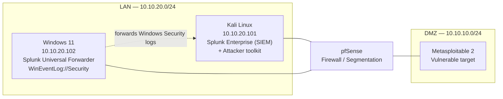

| Component | Role | Address |
| --- | --- | --- |
| pfSense | Firewall, network segmentation (LAN / DMZ) | gateway |
| Kali Linux | SIEM host (Splunk Enterprise) + attacker box | 10.10.20.101 |
| Windows 11 | Detection target; Splunk Universal Forwarder shipping `WinEventLog://Security` | 10.10.20.102 |
| Metasploitable 2 | Deliberately vulnerable target in the DMZ | 10.10.10.0/24 |

**Stack:** Splunk Enterprise · Splunk Universal Forwarder · Sigma · MITRE ATT&CK · pfSense · NetExec · GitHub Actions (CI)

> Splunk UI: `http://10.10.20.101:8000`

---

## Detection catalog

| # | Technique | ATT&CK ID | Data source | Rule | Status |
| --- | --- | --- | --- | --- | --- |
| 1 | SMB Brute Force | T1110.001 | Windows Security (4625) | `smb_bruteforce.yml` | ✅ Firing |
| 2 | RDP Brute Force | T1110.001 · T1021.001 | Windows Security (4625, Logon Type 10) | `rdp_bruteforce.yml` | ✅ Firing |
| 3 | Network Service Discovery | T1046 | pfSense / firewall logs | `nmap_port_scan.yml` | ✅ Firing |
| 4 | ARP Cache Poisoning (AiTM) | T1557.002 | Network / pfSense | `arp_spoof.yml` | 🚧 In progress |

---

## Project 1: Brute Force Detection (T1110.001) — attack → detect → tune

**Data source:** Windows Security event logs (4625) via Splunk Universal Forwarder · **ATT&CK:** T1110.001 — Password Guessing · **Rule:** `rules/smb_bruteforce.yml` · **Severity:** High (access attempt)

### 1. Attack

Password guessing against SMB on the Windows 11 host using **NetExec (`nxc`)** — Windows 11 negotiates SMBv2/3, which Hydra's SMB module doesn't handle cleanly, so NetExec is the correct tool for the target.

```bash
nxc smb 10.10.20.102 -u administrator -p wordlist.txt
```

Each failed attempt generates **Event ID 4625** on the target, forwarded to Splunk by the Universal Forwarder. *(Test credentials are intentionally not published.)*

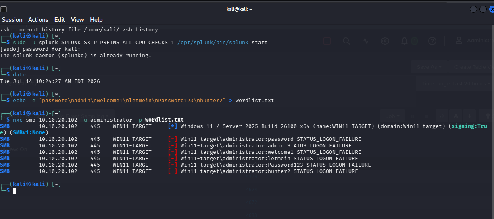

The raw 4625 events land in Splunk, one per failed logon:

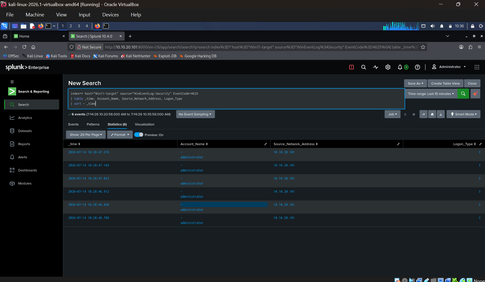

### 2. Detect

The core detection counts failed logons per source over a short window and flags any source that clears the threshold:

```spl
index=* host="Win11-target" source="WinEventLog:Security" EventCode=4625
| stats count AS failed_attempts,
        values(Account_Name) AS targeted_accounts,
        min(_time) AS first_attempt,
        max(_time) AS last_attempt
        by Source_Network_Address
| where failed_attempts > 5
| sort - failed_attempts
```

**Validated result:** source `10.10.20.101`, 6 failed attempts against `administrator`, the entire burst under one second — an automation signature no human produces.

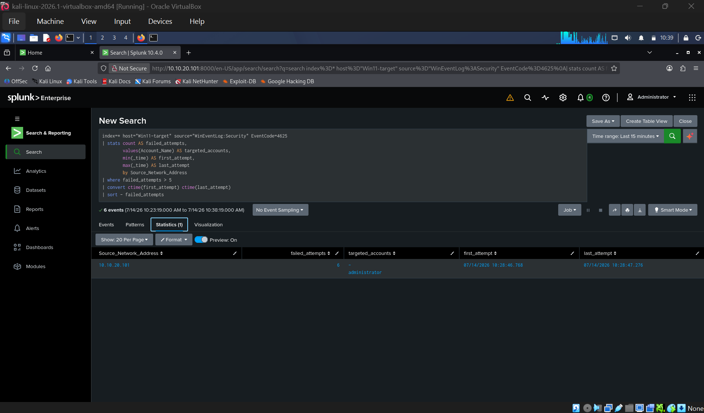

Saved as a scheduled alert (severity High) that fires into the Triggered Alerts queue:

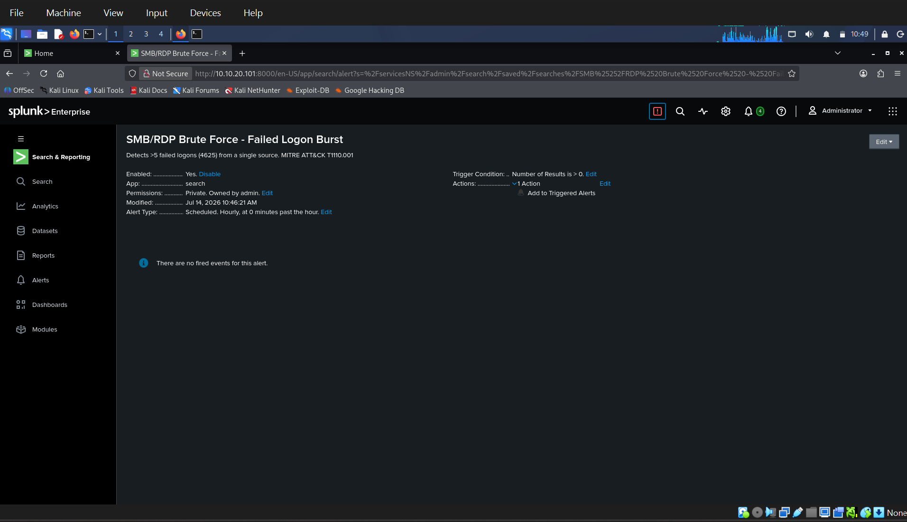
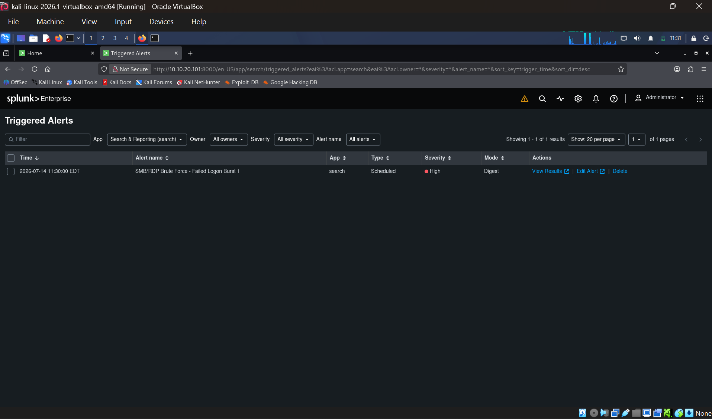

The same signal drives a **SOC Brute Force Monitor** dashboard for at-a-glance triage:

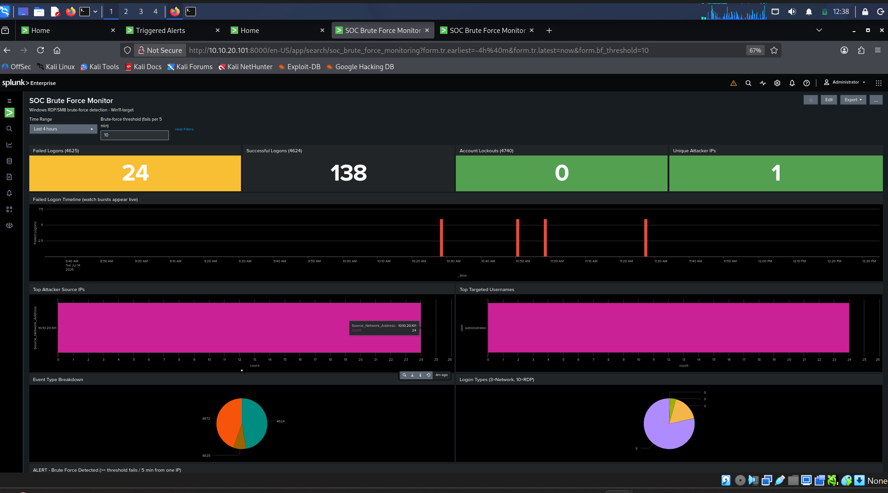

### 3. Tune

**Field-name normalization matters.** Identical events surface under different field names depending on ingestion path — Splunk's compiler-generated fields vs. raw ingestion name the same data differently (`Source_Network_Address` / `Account_Name`). The rule ships in two SPL variants so it fires regardless of how the data was onboarded; a detection that silently matches zero events because of a field-name mismatch is worse than no detection at all.

The **sub-second burst window** is itself a tuning lever: rate-based logic separates automated brute force (dozens of attempts in under a second) from a user mistyping their password twice, keeping the false-positive rate low enough that analysts trust the alert.

### RDP variant (T1021.001)

The same 4625 correlation, filtered to **Logon Type 10 (RemoteInteractive)**, detects RDP brute force and maps additionally to T1021.001 (Remote Services: RDP). Splitting on logon type lets one telemetry source cover two distinct techniques with two tuned rules rather than one noisy catch-all.

---

## Project 2: Network Service Discovery Detection (T1046) — attack → detect → tune

**Data source:** pfSense firewall logs (syslog → Splunk) · **ATT&CK:** T1046 — Network Service Discovery · **Rule:** `rules/nmap_port_scan.yml` · **Severity:** Medium (reconnaissance, not compromise)

Project 1 detected an attack using Windows Security events. This project deliberately uses a **different telemetry source** — network firewall logs — to cover an attack that leaves *no trace on the endpoint at all*.

### 1. Attack

Nmap TCP SYN scan from Kali (LAN) against Metasploitable 2 (DMZ), crossing pfSense:

```bash
sudo nmap -sS -p 1-1000 10.10.10.101
```

1000 ports probed in 3.3 seconds; 12 open services identified (ftp, telnet, smtp, netbios-ssn, microsoft-ds, and the r-services on 512/513/514).

**Why the scan had to cross segments.** Project 1 documented that Kali and the Windows target share the `10.10.20.0/24` LAN, so pfSense never sees traffic between them. Scanning the DMZ host forces the traffic through the firewall, making it visible. The lab's own topology limitation dictated the target choice.

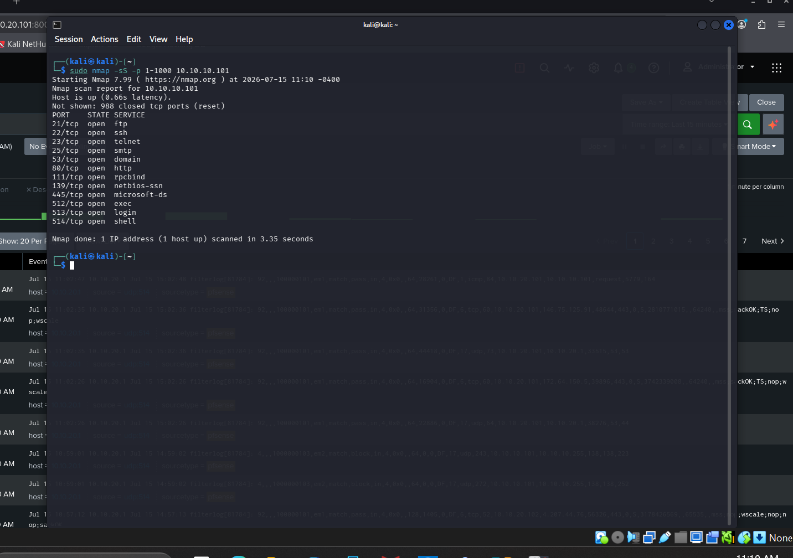

### 2. Telemetry pipeline

pfSense has no Splunk forwarder — it ships logs via syslog. Setup:

- Splunk `UDP:514` input, sourcetype `pfsense`
- pfSense → Status → System Logs → Settings → Remote Logging → `10.10.20.101:514`, Firewall Events only
- **Enabled logging on the LAN allow rule**

The third step is the one that matters. pfSense logs its default *deny* rule automatically but ships *allow* rules with logging off. The Nmap scan is permitted traffic, so with default settings the firewall passes all 1000 packets and writes nothing. **A firewall having visibility of traffic and a firewall recording it are two different things.**

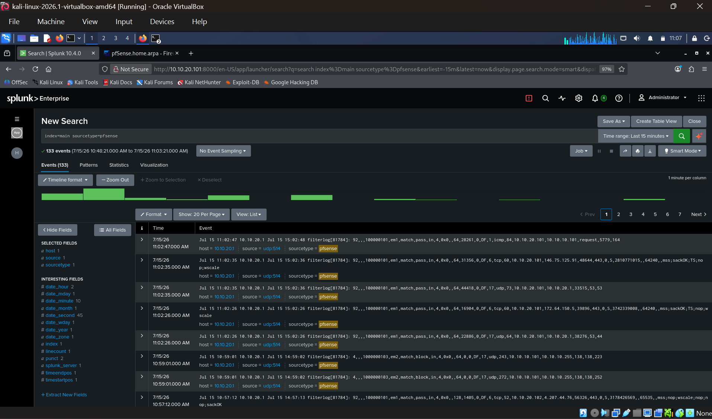

### 3. Parsing

Splunk indexes pfSense `filterlog` events as unstructured text — no `src_ip`, no `dest_port`, no `action`. Fields are extracted at search time with `rex` against pfSense's documented CSV field order:

```spl
index=main sourcetype=pfsense filterlog
| rex "filterlog\[\d+\]:\s(?<rulenr>[^,]*),(?<subrulenr>[^,]*),(?<anchor>[^,]*),(?<tracker>[^,]*),(?<realint>[^,]*),(?<reason>[^,]*),(?<action>[^,]*),(?<direction>[^,]*),(?<ip_ver>[^,]*),(?<tos>[^,]*),(?<ecn>[^,]*),(?<ttl>[^,]*),(?<ip_id>[^,]*),(?<offset>[^,]*),(?<flags>[^,]*),(?<proto_id>[^,]*),(?<proto>[^,]*),(?<length>[^,]*),(?<src_ip>[^,]*),(?<dest_ip>[^,]*),(?<src_port>[^,]*),(?<dest_port>[^,]*)"
| table _time, action, proto, src_ip, src_port, dest_ip, dest_port
```

> **Note:** this positional field order is for **IPv4 TCP/UDP** filterlog rows. IPv6 and ICMP rows carry a different field count and will misalign — filter on `ip_ver=4` (or on `proto`) before relying on the extractions, and validate against your own `filterlog` samples before reuse.

This keeps the detection self-contained — it runs against raw ingestion without requiring the pfSense TA to be installed first.

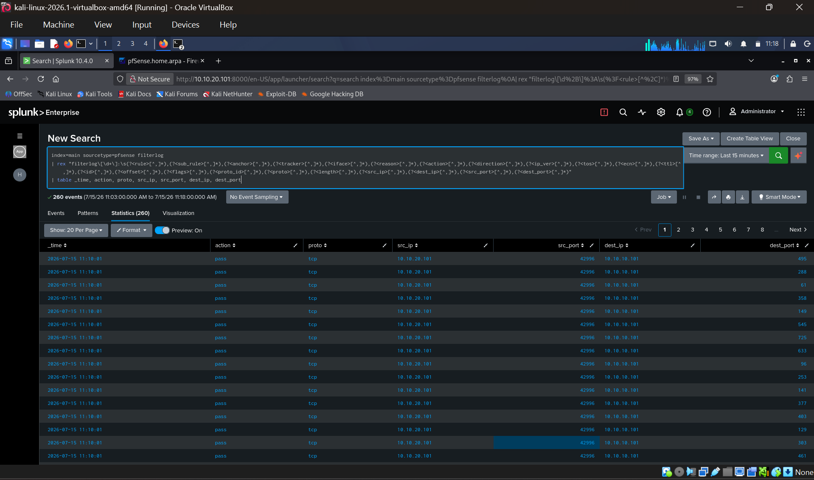
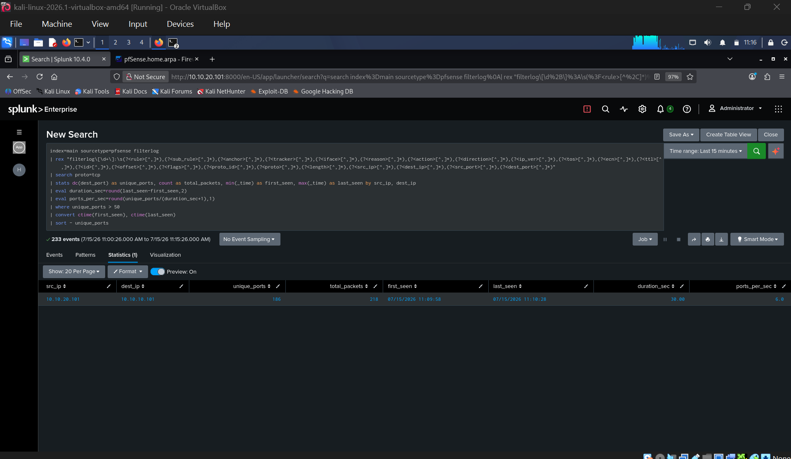

### 4. Detect

```spl
index=main sourcetype=pfsense filterlog
| rex "filterlog\[\d+\]:\s(?<rulenr>[^,]*),(?<subrulenr>[^,]*),(?<anchor>[^,]*),(?<tracker>[^,]*),(?<realint>[^,]*),(?<reason>[^,]*),(?<action>[^,]*),(?<direction>[^,]*),(?<ip_ver>[^,]*),(?<tos>[^,]*),(?<ecn>[^,]*),(?<ttl>[^,]*),(?<ip_id>[^,]*),(?<offset>[^,]*),(?<flags>[^,]*),(?<proto_id>[^,]*),(?<proto>[^,]*),(?<length>[^,]*),(?<src_ip>[^,]*),(?<dest_ip>[^,]*),(?<src_port>[^,]*),(?<dest_port>[^,]*)"
| search proto=tcp
| stats dc(dest_port) as unique_ports, count as total_packets,
        min(_time) as first_seen, max(_time) as last_seen by src_ip, dest_ip
| eval duration_sec=round(last_seen-first_seen,2)
| eval ports_per_sec=round(unique_ports/(duration_sec+1),1)
| where unique_ports > 50
| convert ctime(first_seen), ctime(last_seen)
| sort - unique_ports
```

No individual packet is malicious. The detection is **behavioural**: it asks how many distinct destination ports a single source touched on a single host. Normal clients touch a handful.

**Result:** 186 unique ports, 218 packets, `10.10.20.101 → 10.10.10.101`.

A secondary indicator visible in the parsed data: `src_port` stayed fixed at `42996` across every probe while `dest_port` varied randomly. A normal TCP client draws a fresh ephemeral source port per connection; Nmap's SYN scan reuses one raw socket. This is a viable detection on its own.

### 5. Finding: firewall log fidelity collapses under scan bursts

Nmap sent 1000 probes. Splunk indexed ~186. **Roughly 80% of the scan was never logged.**

The loss was isolated with a packet capture on the Splunk host, run while the scan executed:

```bash
sudo tcpdump -i eth0 -n udp port 514 | wc -l
# 114 packets captured, 0 packets dropped by kernel
```

Only ~114 syslog datagrams crossed the wire against 1000 probes — and some of those were unrelated background traffic. This rules out the two obvious suspects: UDP transport loss and Splunk's receive buffer are both **exonerated**, because the packets never left pfSense to begin with. The loss occurs *inside* pfSense, before the log becomes a log.

Mechanism is consistent with **pflog0 buffer overflow** — pfSense writes matched packets to a fixed-size BPF device that the `filterlog` daemon drains, and at ~300 packets/second the buffer fills faster than it can be read, with the excess discarded silently. This is an inference from the isolation test, not a directly measured cause; `netstat -B` on the pfSense shell would confirm it via per-device drop counters.

The firewall enforced all 1000 packets correctly. It only *narrated* about 11% of them.

**Consequence for detection design.** No downstream fix recovers this data — TCP syslog, TLS, or a disk-buffering collector would all inherit the same loss, because it happens at the source. The pipeline's fidelity degrades precisely when an attack is loudest. This directly shaped the rule:

| Approach | Behaviour under ~89% log loss |
| --- | --- |
| `dc(dest_port) > 50` — cardinality | **Fires.** 186 distinct ports still clears the threshold |
| `count > 900` — volume | **Silent.** Sees 218 packets, misses the scan entirely |

Cardinality-based thresholds degrade gracefully under sampling; volume-based thresholds do not. A threshold tuned against the attack's *true* rate rather than the pipeline's *observed* rate is a rule that fails when it matters.

### 6. Alerting

Saved as a scheduled alert, hourly, 60-minute lookback, trigger on Number of Results > 0 (the `where unique_ports > 50` clause does the real filtering), throttled to suppress duplicates.

**Medium severity, deliberately.** A port scan is an adversary *looking*, not an adversary *in*. Project 1's brute-force is High because it is an access attempt. Grading all detections High trains analysts to ignore the queue.

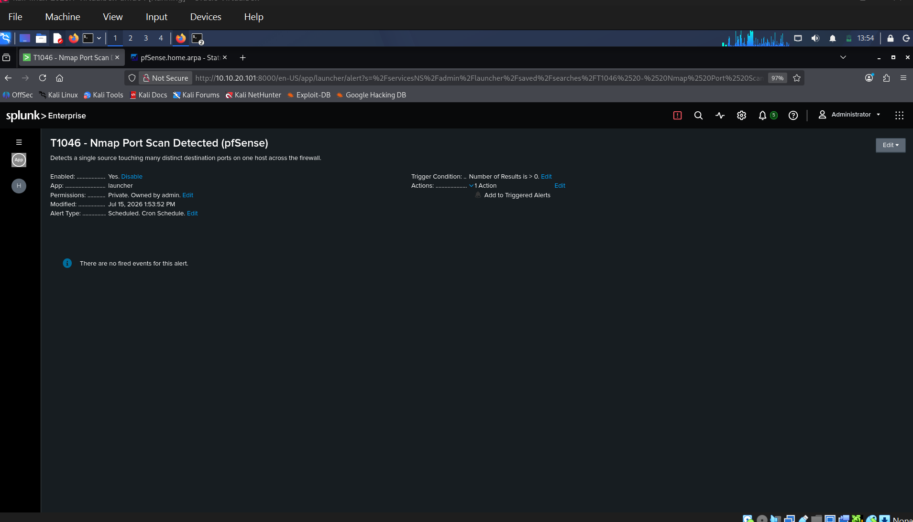

---

## Detection-as-code & CI

Every rule lives in `rules/` as a Sigma document and is validated on each push by a GitHub Actions workflow that runs `sigma check`. A rule that doesn't parse can't merge.

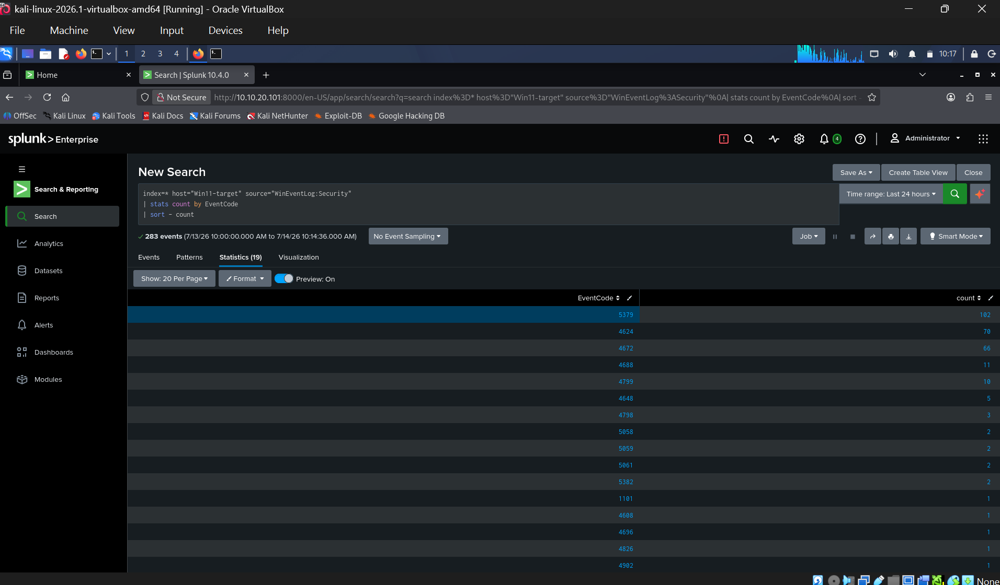

**Honest caveat on the Splunk backend.** Some detections here are inherently temporal (e.g. a successful logon *following* a burst of failures). Sigma's Splunk backend does not currently support `temporal_ordered` correlation, so where the spec can't express the logic, the hand-written SPL that actually runs is committed alongside the spec-compliant Sigma rule. The Sigma expresses portable intent; the SPL is the implementation. Rule-specific caveats (e.g. the tumbling-vs-sliding-window limitation on the port-scan correlation, and the missing pfSense field-extraction pipeline) are documented inline in Project 2.

---

## Repository structure

```
├── rules/                  # Sigma detection rules (validated in CI)
│   ├── smb_bruteforce.yml
│   ├── rdp_bruteforce.yml
│   └── nmap_port_scan.yml
├── spl/                    # Hand-written Splunk SPL — the queries that actually run
├── .github/workflows/      # CI: `sigma check` on every push
├── p1_*.png / p2_*.png     # Alert + dashboard evidence
└── README.md
```

---

## About

Built by **Mithil Pashapu** — M.S. Cybersecurity (Florida Atlantic University). Detection engineering / SOC / purple team.

- GitHub: [Mithilreddy62](https://github.com/Mithilreddy62)
